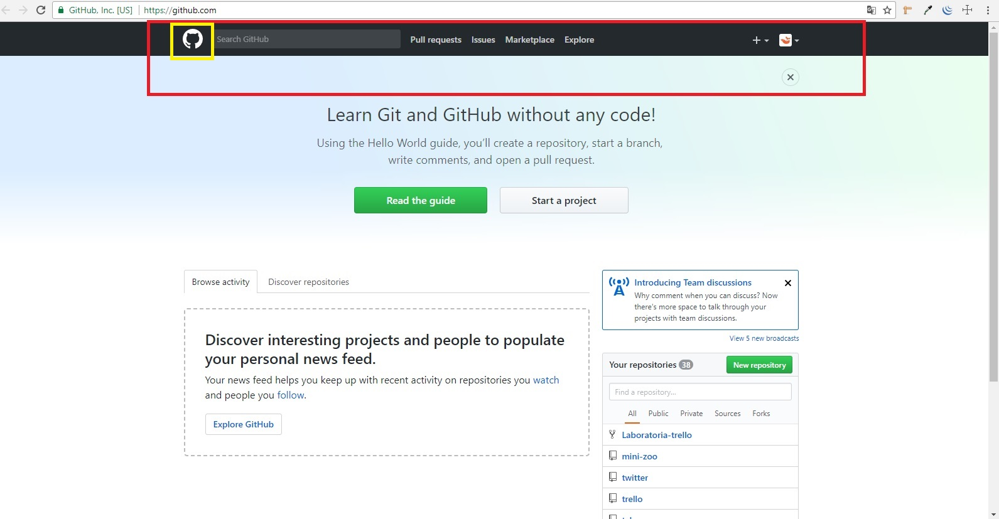
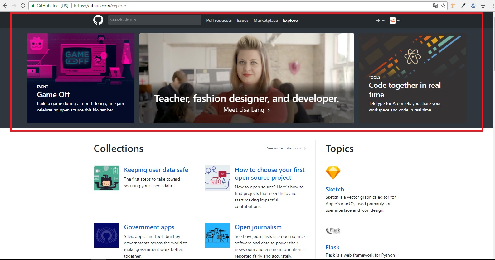
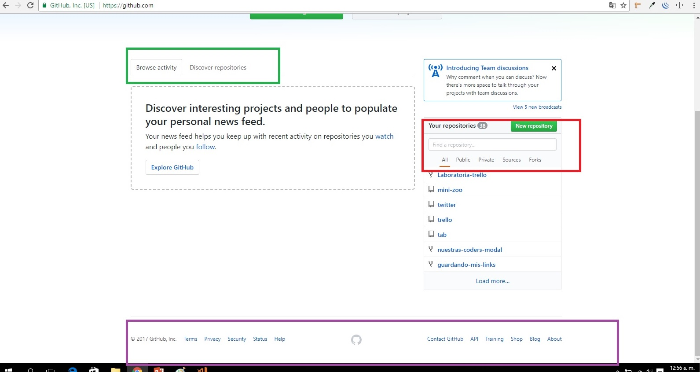
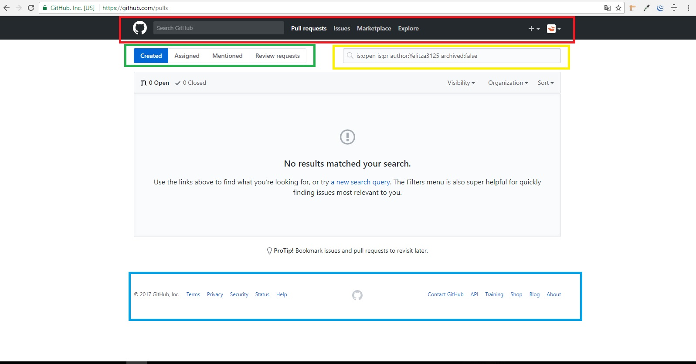
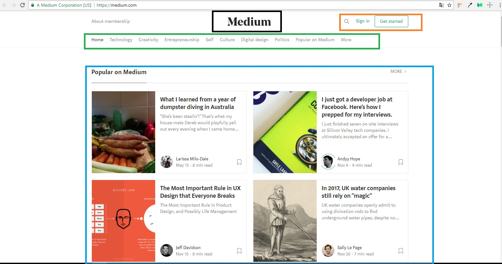
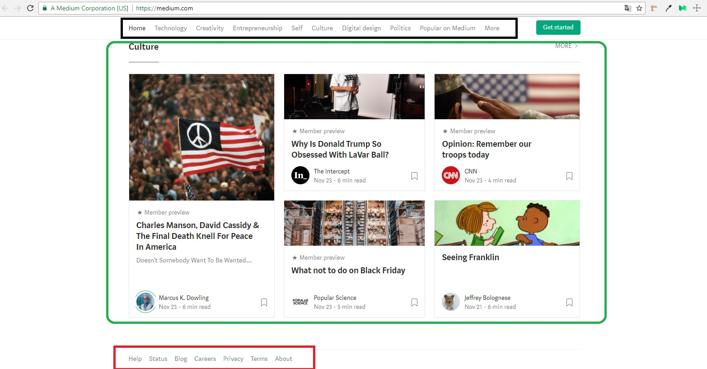
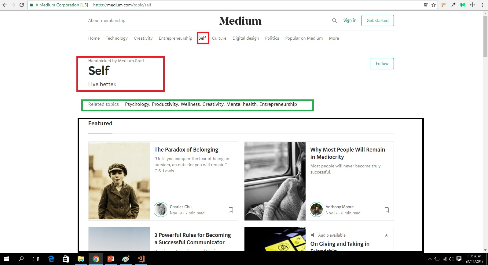
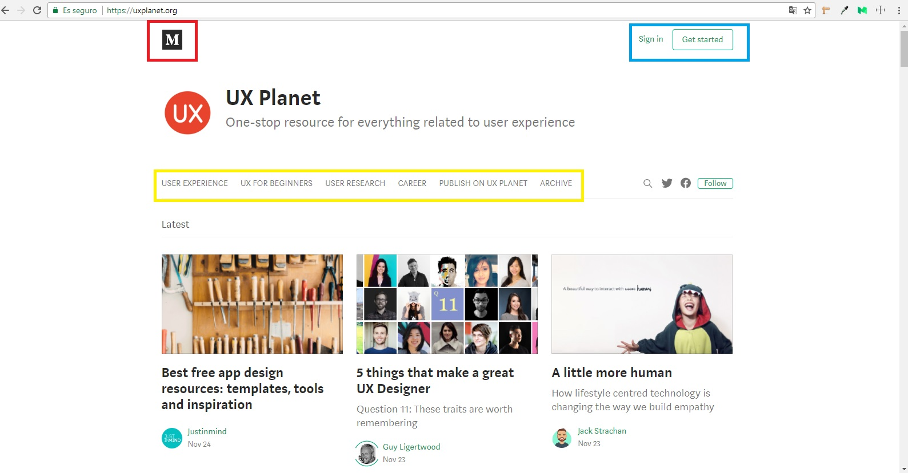

# Reto N° 2: Identifica los elementos de navegación.

## Descripción del Reto:

Identificar los elementos de navegación.

## Breather

### Figura 1:

1. El marco rojo indica una navegación global, para explorar todas las opciones de la página web.

2. El marco verde señala el identificador de la página, en este caso el logotipo, que siempre llevará a la sección principal.

### Figura 2:

1. Tenemos las subsecciones de la página que se obtienen luego de dar click en el ícono del menu hamburguesa. Las subsecciones son del tipo facetada, ya que no da opción al usuario de hacer un filtro personalizado.

2. También tenemos la opción de ver la totalidad de opciones de cada opción al final de cada lista. 

### Figura 3:

1. En el marco rojo tenemos el footer, que contiene a la vez las utilidades que nos ayudan a navegar en la página web. 

2. El marco verde señala el identificador de la página por si el usuario desea regresar al inicio.

3. También en el lado derecho inferior está un botón search, por si el usuario necesita ayuda para ubicar algún contenido.

### Figura 4:

1. El marco rojo señala la navegación de tipo global que se mantiene en cada site de la página.

2. El marco negro señala un tipo de navegación facetada, porque se dan opciones predertimandas al usuario, para que solo busque en aquellas ciudades. 

### Figura 5:

1. El marco rojo señala la navegación de tipo global que se mantiene en cada site de la página.

2. El marco verde señala un tipo de navegación filtrada porque le da opción al usuario de aplicar filtros a "when" y "where", de acuerdo a la ciudad en la que se encuentra. Además tiene una opción de más filtros al lado derecho.

## Github

### Figura 1:

1. El marco rojo señala la navegación global.

2. El marco amarillo señala el identificador de la página.

3. Al lado del identificador tenemos el buscador directo. 

### Figura 2:

1. El marco rojo señala las subsecciones de la opción explore.

2. Debajo tenemos opciones de navegación por "colecciones" y "temas".

3. En la parte superior se mantiene la navegación global.

### Figura 3:

1. El margo verde señala las pestañas que indican el lugar donde se encuentra el usuario.

2. El marco rojo señala la navegación facetada de búsqueda de repositorios, además de un buscador search directo.

3. En el footer tenemos una navegación global que se mantiene en cada página del site.

### Figura 4:

1. El marco rojo señala la navegación global que se mantiene en cada site de la página.

2. El marco verde señala la navegación local de la sección a la que se ha accedido. 

3. El marco amarillo, señala un elemento search.

4. El marco celeste encierra el footer, que es un tipo de navegación global, pues también se mantiene en cada site de la página.

## Medium

### Figura 1:

1. El marco naranja señala las utilidades de la página.

2. El marco verde señala la navegación global de las secciones de la página.

3. El marco negro señala el identificador de la página, en este caso el logotipo.

4. El marco celeste señala la navegación de una de las secciones, mostrando primero lo más buscado y una opción de cargar más.

### Figura 2:

1. El marco negro señala la navegación global que se mantiene aunque se baje el scroll al explorar la página.

2. El marco verde señala otra sección de la página y como se muestran los temas vistos recientemente.

3. El marco rojo señala el footer que se mantiene en cada página, con un tipo de navegación global.

### Figura 3:

1. El marco rojo indica al usuario donde se encuentra en la página. 

2. El marco verde son las opciones de navegación facetada de la subsección "Self".

3. El marco negro señala las opciones de navegación según el tema seleccionado.

### Figura 4:

1. El marco rojo señala el identificador que lleva al usuario de regreso a la página principal.

2. El marco celeste señala las utilidades.

3. El marco amarillo señala la navegación local de la subsección

