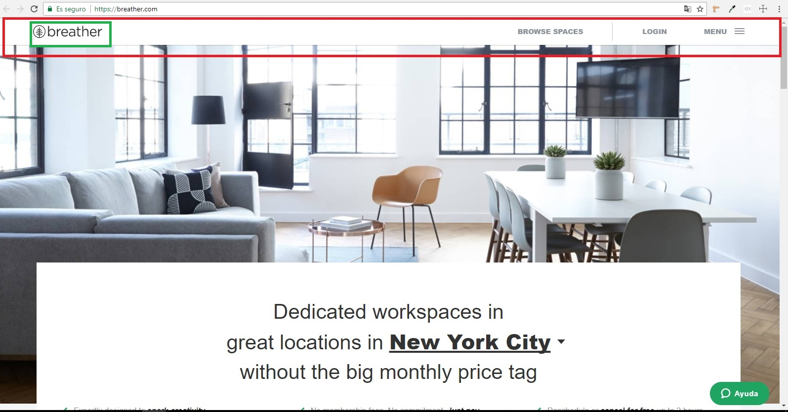
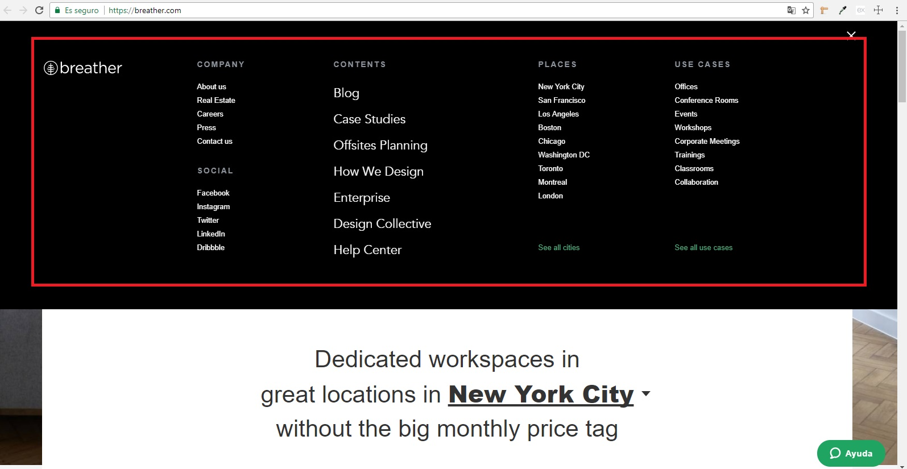
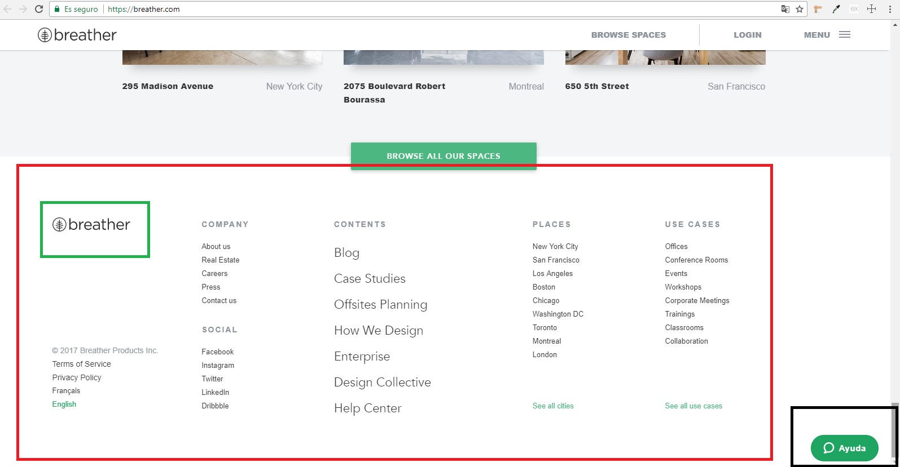
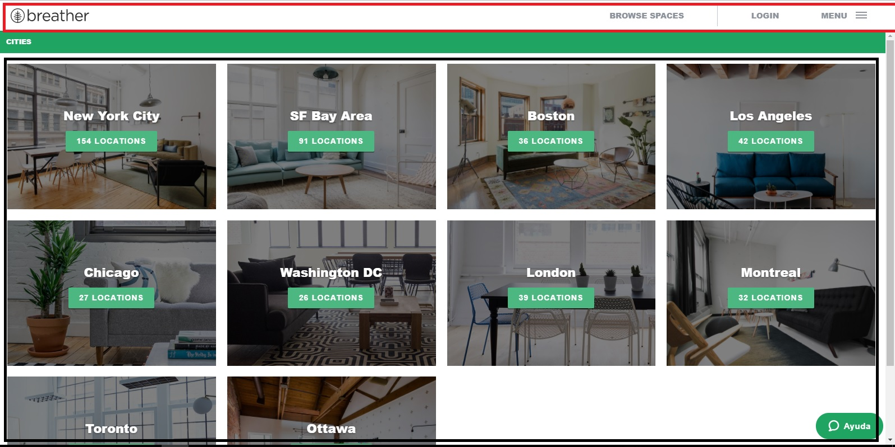
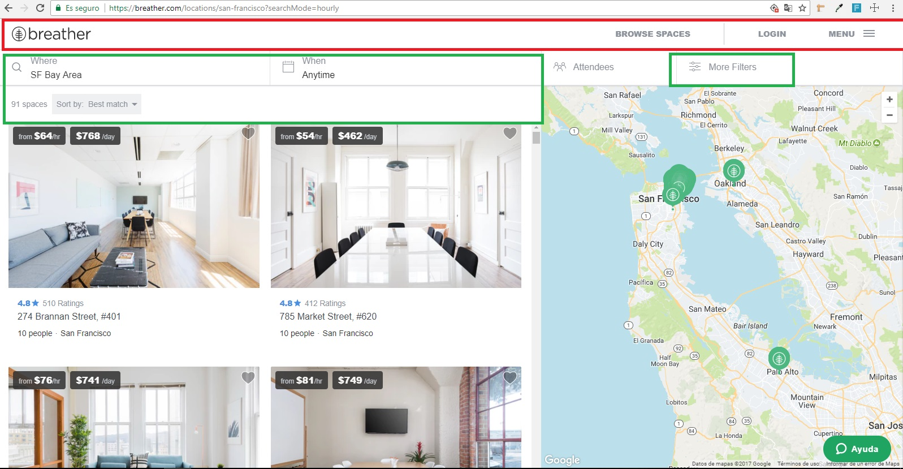

# Reto N° 2: Identifica los elementos de navegación.

## Descripción del Reto:

Identificar los elementos de navegación.

## Breather

### Figura 1:

1. El marco rojo indica una navegación global, para explorar todas las opciones de la página web.

2. El marco verde señala el identificador de la página, en este caso el logotipo, que siempre llevará a la sección principal.

### Figura 2:

1. Tenemos las subsecciones de la página que se obtienen luego de dar click en el ícono del menu hamburguesa. Las subsecciones son del tipo facetada, ya que no da opción al usuario de hacer un filtro personalizado.

2. También tenemos la opción de ver la totalidad de opciones de cada opción al final de cada lista. 

### Figura 3:

1. En el marco rojo tenemos el footer, que contiene a la vez las utilidades que nos ayudan a navegar en la página web. 

2. El marco verde señala el identificador de la página por si el usuario desea regresar al inicio.

3. También en el lado derecho inferior está un botón search, por si el usuario necesita ayuda para ubicar algún contenido.

### Figura 4:

1. El marco rojo señala la navegación de tipo global que se mantiene en cada site de la página.

2. El marco negro señala un tipo de navegación facetada, porque se dan opciones predertimandas al usuario, para que solo busque en aquellas ciudades. 

### Figura 5:

1. El marco rojo señala la navegación de tipo global que se mantiene en cada site de la página.

2. El marco verde señala un tipo de navegación filtrada porque le da opción al usuario de aplicar filtros a "when" y "where", de acuerdo a la ciudad en la que se encuentra. Además tiene una opción de más filtros al lado derecho.

